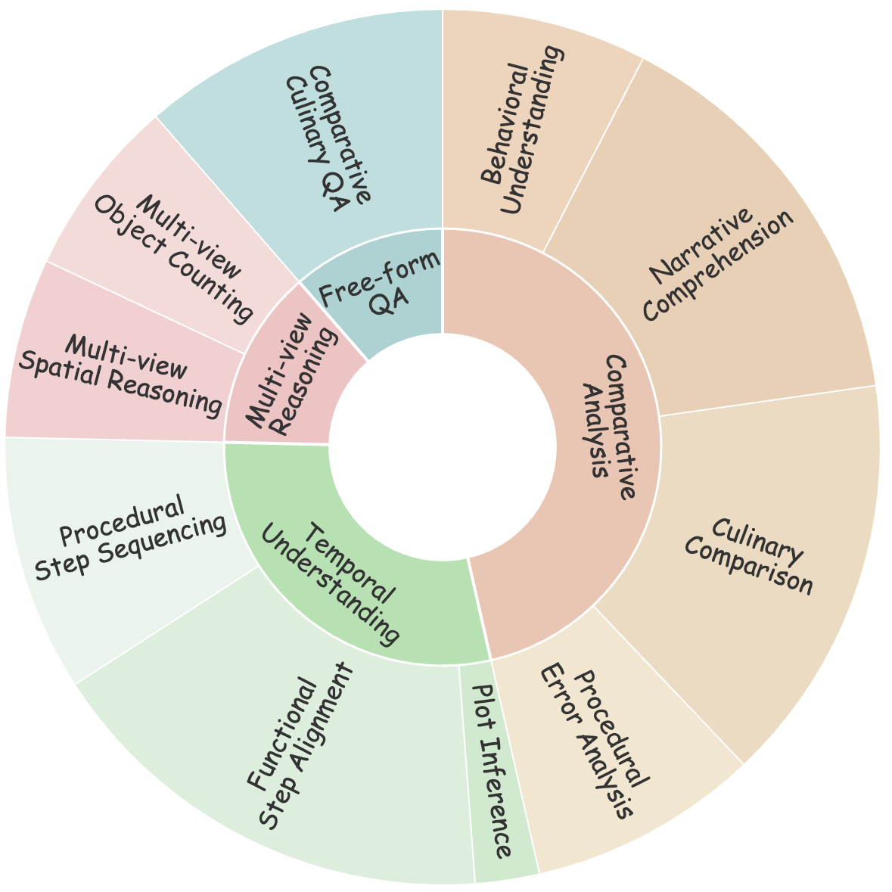
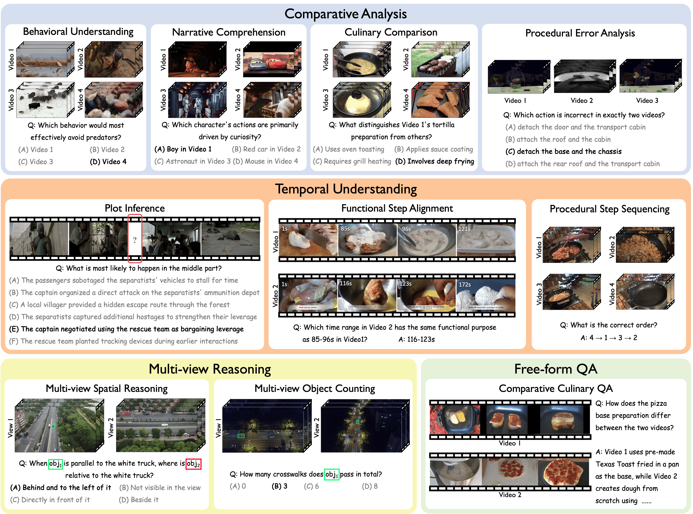
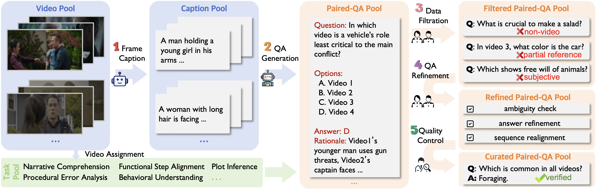

# CrossVid: A Comprehensive Benchmark for Evaluating Cross-Video Reasoning in Multimodal Large Language Models 🎬

<div align="center">

[](https://arxiv.org/abs/2511.12263)
[](https://huggingface.co/datasets/Chuntianli/CrossVid)
[](LICENSE)


</div>

---

## 🌟 Introduction

**CrossVid** is the first comprehensive benchmark for evaluating **Cross-Video Reasoning (CVR)** in Multimodal Large Language Models (MLLMs). Unlike existing benchmarks focusing on single-video analysis, CrossVid challenges models to simultaneously understand, aggregate, and compare information across multiple videos.

**Key Highlights:**
- 🎯 **First systematic CVR benchmark** with hierarchical task design
- 📊 **9,015 QA pairs** across 5,331 videos from 6 diverse datasets
- 🏗️ **10 specific tasks** spanning 4 dimensions (Comparative, Temporal, Multi-View, Free-Form)
- 🌐 **32 genres** covering real-world scenarios
- ⏱️ **Long-context**: Average 770 seconds per query
- 📝 **Multiple formats**: Single-choice, multiple-choice, and open-ended questions

<div align="center">


</div>

---

## 📢 News

- **[2025-11]** 🎉 CrossVid accepted by **AAAI 2026**!
- **[2025-11]** 📊 Dataset available on [HuggingFace](https://huggingface.co/datasets/Chuntianli/CrossVid).
- **[2025-11]** 🔧 Evaluation code uploaded.

---

## 🎯 Benchmark Overview

### Task Dimensions

**📊 Comparative Analysis** - Behavioral Understanding  (BU), Narrative Comprehension (NC), Culinary Comparison (CC), and Procedural Eror Analysis (PEA)

**⏱️ Temporal Understanding** - Plot Inference (PI), Functional Step Alignment (FSA), Procedural Step Sequencing (PSS)

**👁️ Multi-View Reasoning** - Multi-view Spatial Reasoning (MSR) and Multi-view Object Counting (MOC)

**✍️ Free-Form QA** - Comparative Culinary QA (CCQA)

### Data Sources & Statistics

Videos from **6 public datasets**: Animal Kingdom 🦁 | MovieChat-1K 🎬 | YouCook2 👨‍🍳 | VisDrone 🚁 | Charades 🏠 | Assembly101 🔧. 

We thank the creators of these valuable datasets for providing the foundational video resources. 

| Metric | Value | Metric | Value |
|--------|-------|--------|-------|
| 📹 Videos | 5,331 | 🎭 Genres | 32 |
| ❓ QA Pairs | 9,015 | 🎯 Tasks | 10 |
| ⏱️ Avg Video Length | 215s | 📊 Avg Query Duration | 770s |

---

## 📸 Examples

<div align="center">

<p><i>Representative examples showing different cross-video reasoning tasks</i></p>
</div>

---

## 🏗️ Annotation Pipeline

<div align="center">

</div>

**Process**: Frame Extraction (Qwen2.5-VL-72B) → QA Generation (DeepSeek-R1) → Manual Filtration → Refinement → Quality Control


---

## 🚀 Quick Start
We provide a evaluation script named by the task name that supports parallel inference using OpenAI-compatible APIs (e.g., **vLLM**, **LMDeploy**, or **SGLang**).

### 1. Preparation

Before running the evaluation, download dataset from Huggingface and clone this repository. Ensure your environment are set up correctly:

**Directory Structure**  
Ensure your project directory looks like this:
```text
CrossVid/
│── uav/                 # Folder containing uav files
│   ├── bbox/
│   └── frames/
├── videos/              # Folder containing video files
│   ├── assembly/
│   ├── behavior/
│   ├── cook/
│   └── movie/
│── QA/                  # Folder containing QA JSON files (e.g., BU.json)
│   ├── BU.json
│   ├── CC.json
│   ├── CCQA.json
│   ├── ...
|── eval/                # The evaluation scripts
│   ├── utils/
│   ├── BU.py
│   ├── CC.py
│   ├── ...
│   ├── score_CCQA.py
└── README.md
```

**Python environment**  
Install the following required packages:
```bash
pip install openai opencv-python decord numpy
```

Enter root directory:
```bash
cd CrossVid
```

### 2. Run Evaluation
To evaluate a task, run the evaluation script with the following command. The script will process videos, perform inference via the API, and automatically calculate the accuracy.
For example, you can evaluate task BU via:
```bash
python eval/BU.py \
    --model "your-model-name" \
    --video_root "videos" \
    --QA_path "QA/BU.json" \
    --save_path "results/BU_result.json" \
    --port 8000 \
    --threads 20
```

### 3. Arguments

| Argument | Type | Default | Description                                           |
| :--- | :--- | :--- |:------------------------------------------------------|
| `--model` | `str` | **Required** | The model name used for inference.                    |
| `--QA_path` | `str` | `QA/BU.json` | Path to the input Question-Answer JSON file.          |
| `--video_root` | `str` | `videos` | Root directory containing the video files.            |
| `--save_path` | `str` | **Required** | Path where the inference results will be saved.       |
| `--port` | `int` | `8000` | The port number of your running API server.           |
| `--threads` | `int` | `20` | Number of parallel threads for faster inference.      |
| `--frames` | `int` | `128` | Total number of frames to sample per inference.       |
| `--length` | `int` | `360` | The resolution length (long side) for frame resizing. |


### 4. Output & Metrics
Upon completion, the script saves detailed results to the specified JSON file and prints the overall accuracy:
```text
The performance of <model_name> on task BU is 0.654
```

### 5. Open-ended Evaluation
For open-ended tasks (e.g., **CCQA**), we employ an **LLM-as-a-Judge** approach to score responses based on **Coverage** and **Correctness** of key scoring points.

Remember to configure the API key/URL in `eval/score_CCQA.py`).

```bash
python eval/score_CCQA.py \
    --QA_path "QA/CCQA.json" \
    --answer_path "results/CCQA_result.json" \
    --save_path "results/CCQA_score.json"
```
---


# 📊 Leaderboard

## Benchmark Results

The following table shows the performance of 22 evaluated MLLMs on CrossVid dataset, ranked by Overall Average (O.Avg) score.

### Model Leaderboard

| Rank | Model | #Frames | O.Avg | C.Avg | T.Avg | M.Avg | CCQA |
|:----:|:------|:-------:|:-----:|:-----:|:-----:|:-----:|:----:|
| | ***Closed-Source Models*** |
| 🥇 | Gemini-2.5-Pro | 128 | **50.4** | **54.7** | **56.0** | 28.7 | **59.8** |
| 🥈 | GPT-4.1 | <50 | 45.2 | 47.6 | 46.7 | **38.4** | 44.6 |
| 🥉 | Doubao-1.5-VL-pro | 256 | 44.3 | 53.8 | 36.1 | 34.7 | 50.1 |
| 4 | GPT-4o | <50 | 36.8 | 43.1 | 35.5 | 27.4 | 34.2 |
| | ***Open-Source Models*** |
| 5 | GLM-4.1V-9B-Thinking | 256 | **35.1** | **44.7** | 23.1 | **37.8** | 26.9 |
| 6 | Qwen2.5-VL-72B | 256 | 34.4 | 42.1 | 29.2 | 23.5 | **41.2** |
| 7 | Qwen2.5-VL-32B | 256 | 33.7 | 38.3 | 26.5 | 31.7 | **41.2** |
| 8 | MiMo-7B | 256 | 28.3 | 31.2 | 23.0 | 33.6 | 22.0 |
| 9 | Kimi-VL-A3B-Thinking | 256 | 28.2 | 33.4 | 17.9 | 32.7 | 29.2 |
| 10 | LLaVA-Video-72B | 128 | 27.5 | 33.9 | 22.0 | 27.9 | 17.8 |
| 11 | LLaVA-OV-72B | 24 | 27.5 | 27.9 | **29.3** | 30.5 | 14.6 |
| 12 | InternVL3-78B | 128 | 25.8 | 33.1 | 15.6 | 28.1 | 23.2 |
| 13 | InternVL3-8B | 128 | 25.6 | 26.1 | 20.3 | **40.7** | 9.7 |
| 14 | MiniCPM-O 2.6 | 128 | 25.6 | 26.2 | 26.4 | 31.4 | 9.0 |
| 15 | ERNIE-4.5-VL-A3B | 440 | 24.8 | 25.4 | 19.7 | 32.5 | 22.5 |
| 16 | Qwen2.5-Omni-7B | 64 | 24.6 | 26.7 | 21.6 | 29.6 | 15.3 |
| 17 | InternVL3-38B | 128 | 23.5 | 27.8 | 10.1 | 38.6 | 16.2 |
| 18 | Video-R1-7B | 256 | 21.6 | 18.5 | **26.9** | 26.9 | 8.0 |
| 19 | Phi-3.5-vision | 64 | 21.5 | 25.9 | 17.2 | 27.6 | 4.3 |
| 20 | Qwen2.5-VL-7B | 256 | 18.3 | 19.3 | 20.0 | 16.8 | 12.0 |
| 21 | LongVA-7B-DPO | 256 | 18.0 | 23.5 | 7.5 | 26.3 | 10.7 |
| 22 | VideoLLaMA3-7B | 180 | 15.3 | 20.8 | 6.7 | 19.8 | 9.8 |

> **Note**: An equal number of frames are sampled uniformly from each video and resized to 360px on the longer side. 
---

### Metrics Description

- **O.Avg**: Overall average accuracy across all ten tasks
- **C.Avg**: Average accuracy on Comparative Analysis tasks (BU, NC, CC, PEA)
- **T.Avg**: Average accuracy on Temporal Understanding tasks (PI, FSA, PSS)
- **M.Avg**: Average accuracy on Multi-view Reasoning tasks (MSR, MOC)
- **CCQA**: Comparative Culinary QA accuracy
- **#Frames**: Total number of input frames per query

> **Note**: Bold numbers in each column indicate the best performance among models in that category.
---

## 📄 License & Contact

<!-- **License**: MIT License - see [LICENSE](LICENSE) -->

**Datasets**: Videos from public datasets - refer to original licenses ([Animal Kingdom](https://github.com/sutdcv/Animal-Kingdom), [MovieChat-1K](https://github.com/rese1f/MovieChat), [YouCook2](http://youcook2.eecs.umich.edu/), [VisDrone](https://github.com/VisDrone/VisDrone-Dataset), [Charades](https://prior.allenai.org/projects/charades), [Assembly101](https://assembly-101.github.io/))

**Contact**: 
- Email: chuntianli666666@gmail.com
- GitHub: [CrossVid](https://github.com/chuntianli666/CrossVid)

**Acknowledgements**: Thanks to dataset authors and our expert annotators.

---

## 📝 Citation
If you find CrossVid useful for your research, please cite our paper:
```bibtex
@article{li2025crossvid,
  title={CrossVid: A Comprehensive Benchmark for Evaluating Cross-Video Reasoning in Multimodal Large Language Models},
  author={Li, Jingyao and Wang, Jingyun and Tan, Molin and Wang, Haochen and Yan, Cilin and Shi, Likun and Cai, Jiayin and Jiang, Xiaolong and Hu, Yao},
  journal={arXiv preprint arXiv:2511.12263},
  year={2025}
}
```

---

<div align="center">

**⭐ Star us on GitHub! ⭐**

[](https://github.com/chuntianli666/CrossVid)

</div>
